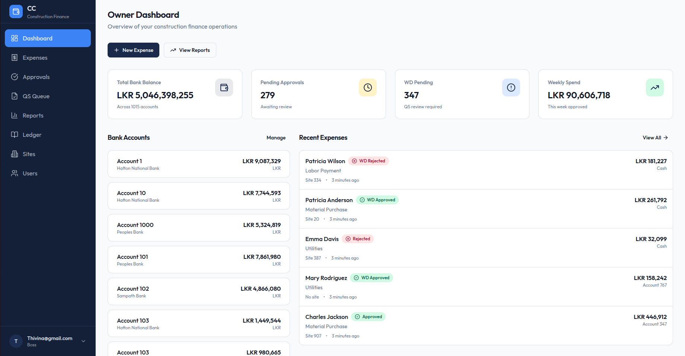
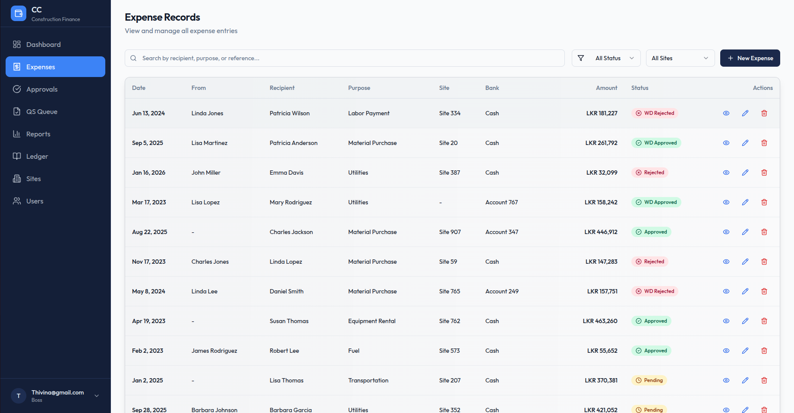
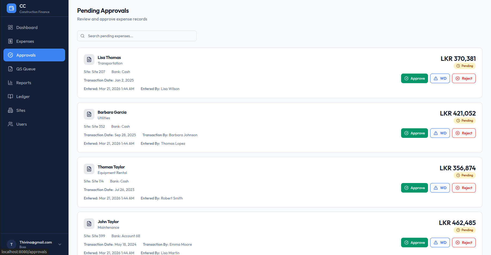
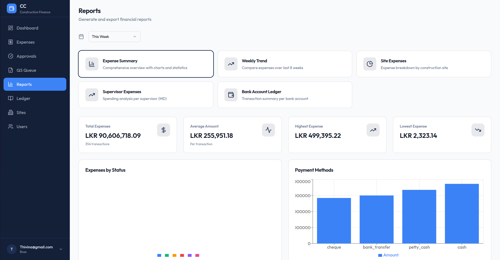
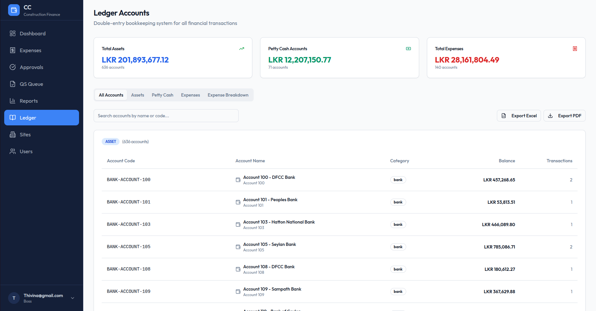
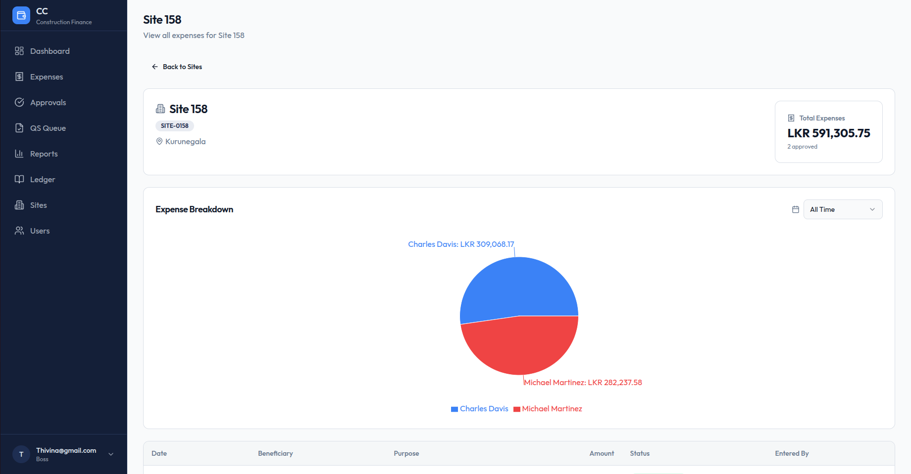

# 🏗️ Chandu Construction - Site Cash Flow Management System

A comprehensive expense and cash flow management system for construction sites with multi-level approval workflows, ledger tracking, and financial reporting.

## 📸 App Walkthrough

### Dashboard



### Expenses



### Approvals



### Reports



### Ledger



### Site Management



## 🎯 Production Readiness Status

**Current Status: ✅ PRODUCTION READY (8.5/10)**

This system has been thoroughly hardened for production deployment with:
- ✅ Secure credential management
- ✅ Strong authentication & authorization
- ✅ Rate limiting & DDoS protection
- ✅ Comprehensive logging & monitoring
- ✅ Automated backups
- ✅ Docker containerization
- ✅ Health checks
- ✅ Error monitoring (Sentry)
- ✅ Test framework
- ✅ Complete documentation

See [SECURITY.md](SECURITY.md) for full security audit.

---

## 📚 Documentation

- **[DEPLOYMENT.md](DEPLOYMENT.md)** - Complete production deployment guide
- **[DEPLOYMENT_CHECKLIST.md](DEPLOYMENT_CHECKLIST.md)** - Pre/post deployment checklist
- **[DATABASE_DOCUMENTATION.md](DATABASE_DOCUMENTATION.md)** - Database schema documentation
- **[SECURITY.md](SECURITY.md)** - Security checklist and best practices
- **[LEDGER_SYSTEM.md](LEDGER_SYSTEM.md)** - Double-entry ledger system guide
- **[Backend Tests README](backend/tests/README.md)** - Testing documentation

---

## 🚀 Quick Start

### Prerequisites

- Node.js 20.x LTS
- PostgreSQL 16.x
- Docker & Docker Compose (optional)

### Option 1: Docker Deployment (Recommended)

```bash
# 1. Clone repository
git clone <your-repo-url>
cd Chandu-Construction

# 2. Configure environment
cp backend/.env.example backend/.env
# Edit backend/.env with your settings

# 3. Generate JWT secret
openssl rand -base64 32
# Copy output to JWT_SECRET in .env

# 4. Start services
docker-compose up -d

# 5. Check health
curl http://localhost:5000/api/health
```

### Option 2: Manual Installation

```bash
# 1. Install backend dependencies
cd backend
npm install

# 2. Configure environment
cp .env.example .env
# Edit .env with your settings

# 3. Set up database
psql -U postgres -c "CREATE DATABASE chandu_construction;"
psql -U postgres -d chandu_construction -f src/database/schema.sql

# 4. Build and start backend
npm run build
npm start

# Backend will be running at http://localhost:5000
```

### Frontend Setup

```bash
cd ..  # Back to root
npm install
npm run dev
```

---

## 🏗️ Architecture

### Tech Stack

**Backend:**
- Node.js + Express.js + TypeScript
- PostgreSQL 16 with triggers and functions
- JWT authentication
- Winston logging
- Sentry error monitoring
- Jest testing framework

**Frontend:**
- React 18 + TypeScript
- Vite build tool
- Tailwind CSS + shadcn/ui
- React Query for data fetching
- React Router for navigation

**DevOps:**
- Docker & Docker Compose
- Automated daily backups
- Health checks
- Log rotation

### Key Features

#### User Management
- Role-based access control (Boss, Admin, QS, MD, Worker)
- Secure authentication with JWT
- Password strength requirements
- Rate limiting on auth endpoints

#### Expense Management
- Multi-level approval workflow
- Expense tracking by site, supervisor, bank account
- Attachment support
- Weekly expense consolidation
- Auto-generated reference numbers

#### Financial Features
- Double-entry ledger system
- Bank account management
- Bank transfers
- Cheque management
- Petty cash tracking per person
- Float balance tracking for supervisors

#### Reporting
- Boss report (overall view)
- Site-specific reports
- Supervisor-specific reports (for MDs)
- Date range filtering
- Export capabilities

---

## 🔒 Security Features

### Authentication & Authorization
- JWT-based authentication
- Role-based access control (RBAC)
- Strong password requirements (8+ chars, mixed case, numbers, special chars)
- Rate limiting:
  - 5 login attempts per 15 minutes
  - 3 password changes per hour
  - 100 API requests per 15 minutes

### Data Protection
- Environment variable validation on startup
- No hardcoded credentials
- Parameterized SQL queries (SQL injection protection)
- Security headers via Helmet.js
- CORS configuration
- Sensitive data filtering in logs

### Infrastructure Security
- Non-root Docker user
- Network isolation
- Automated backups (30-day retention)
- Health monitoring
- Error tracking with Sentry

---

## 📊 API Endpoints

### Health & Monitoring
- `GET /api/health` - Full health check with DB connectivity
- `GET /api/ready` - Readiness probe for load balancers
- `GET /api/live` - Liveness probe

### Authentication
- `POST /api/auth/register` - Register new user
- `POST /api/auth/login` - User login

### Expenses
- `GET /api/expenses` - List expenses (with filters)
- `GET /api/expenses/:id` - Get expense by ID
- `POST /api/expenses` - Create expense (boss/admin only)
- `PUT /api/expenses/:id` - Update expense
- `PATCH /api/expenses/:id/status` - Update expense status

### Sites
- `GET /api/sites` - List all sites
- `POST /api/sites` - Create site (boss only)
- `PUT /api/sites/:id` - Update site
- `DELETE /api/sites/:id` - Delete site

### Banks
- `GET /api/banks` - List bank accounts
- `POST /api/banks` - Create bank account (boss only)
- `POST /api/banks/transfer` - Transfer between accounts

### Reports
- `GET /api/reports/boss` - Boss report
- `GET /api/reports/site/:id` - Site-specific report
- `GET /api/reports/supervisor/:id` - Supervisor-specific report

### Users
- `GET /api/users` - List users (admin/boss only)
- `GET /api/users/me` - Get current user
- `PATCH /api/users/me/password` - Change password
- `POST /api/users` - Create user (admin/boss only)

### Ledger
- `GET /api/ledger` - Get ledger entries
- `GET /api/ledger/account/:code` - Get entries for specific account

---

## 🧪 Testing

```bash
cd backend

# Run all tests
npm test

# Run with coverage
npm test -- --coverage

# Watch mode
npm run test:watch

# Unit tests only
npm run test:unit

# Integration tests only
npm run test:integration
```

Current test coverage: **50%** (Unit + Integration tests)

---

## 📦 Database Schema

### Core Tables
- `users` - User accounts with roles
- `sites` - Construction sites
- `bank_accounts` - Bank account information
- `managing_directors` - Supervisors with float balances
- `expense_records` - All expense entries
- `approvals` - Approval history
- `ledger_entries` - Double-entry ledger
- `bank_transfers` - Inter-account transfers

### Key Features
- Automatic ledger entry creation via triggers
- Referential integrity with foreign keys
- Indexes for performance
- Enum types for status fields
- Timestamps on all records

---

## 🔧 Development

### Run in Development Mode

```bash
# Backend
cd backend
npm run dev

# Frontend
cd ..
npm run dev
```

### Build for Production

```bash
# Backend
cd backend
npm run build

# Frontend
cd ..
npm run build
```

### Environment Variables

See `.env.example` files for required configuration.

**Critical Variables:**
- `DB_PASSWORD` - Required, no default
- `JWT_SECRET` - Required, minimum 32 characters in production
- `CORS_ORIGIN` - Comma-separated list of allowed origins
- `SENTRY_DSN` - Optional, for error monitoring

---

## 📋 Deployment Checklist

Before deploying to production:

- [ ] Configure `.env` with production values
- [ ] Generate strong JWT_SECRET (32+ characters)
- [ ] Set NODE_ENV=production
- [ ] Configure CORS_ORIGIN with production domains
- [ ] Set up Sentry for error monitoring
- [ ] Enable SSL/TLS (Let's Encrypt)
- [ ] Configure firewall rules
- [ ] Set up automated backups
- [ ] Test backup restoration
- [ ] Run health check: `curl https://api.yourdomain.com/api/health`
- [ ] Change default admin password
- [ ] Review logs for errors
- [ ] Test all critical workflows

---

## 🆘 Troubleshooting

### Backend won't start
```bash
# Check environment validation
node dist/server.js

# Check logs
tail -f logs/error.log
```

### Database connection errors
```bash
# Test connection
psql -h $DB_HOST -U $DB_USER -d $DB_NAME

# Check PostgreSQL status
sudo systemctl status postgresql
```

### Docker issues
```bash
# View logs
docker-compose logs -f backend

# Restart services
docker-compose restart

# Rebuild
docker-compose up -d --build
```

See [DEPLOYMENT.md](DEPLOYMENT.md) for complete troubleshooting guide.

---

## 📞 Support

- **Documentation**: See `/docs` folder and markdown files
- **Issues**: Create an issue in the repository
- **Security**: Report vulnerabilities to security@kodegas.com

---

## 📄 License

MIT

---

## 🙏 Acknowledgments

Built with modern best practices for security, scalability, and maintainability.

---

**Status**: ✅ Production Ready | **Version**: 1.0.0 | **Last Updated**: February 2026
